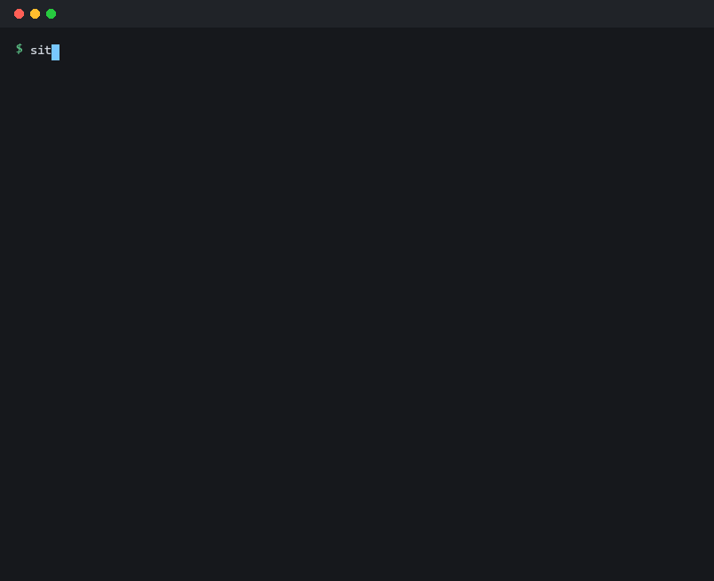
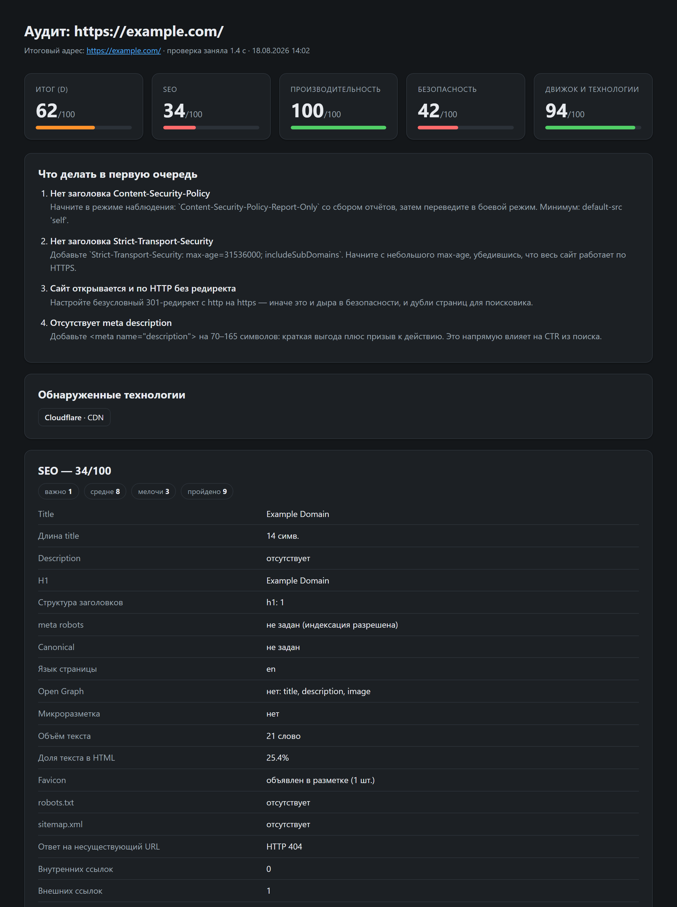

# siteaudit

Инструмент полного аудита сайта из командной строки: **SEO**, **производительность**,
**безопасность** и **определение движка**. По каждой находке выдаёт не только «что не так»,
но и конкретную рекомендацию — что сделать.

Отчёт выводится в терминал, а также сохраняется в самодостаточный HTML или в JSON для CI.



### HTML-отчёт

Флаг `--html` сохраняет самодостаточную страницу: работает без интернета, сама
подстраивается под светлую и тёмную тему, годится для отправки заказчику.



## Установка

Создание и активация виртуального окружения

```bash
python -m venv venv
```

```bash
.\venv\Scripts\activate
```

Установка зависимостей

```bash
pip install -r requirements.txt
```

Либо как пакет с командой `siteaudit`:

```bash
pip install -e .
```

Модуль Core Web Vitals требует браузера — он ставится отдельно и нужен только
для флага `--browser`:

```bash
pip install playwright && playwright install chromium
```

Для подсчёта реальной экономии на изображениях нужна Pillow:

```bash
pip install pillow
```

## Быстрый старт

```bash
python -m siteaudit example.com
```

```bash
python -m siteaudit https://example.com --html отчёт.html --json отчёт.json
```

Полная проверка своего сайта — все восемь модулей сразу:

```bash
python -m siteaudit мойсайт.ру --crawl 50 --depth 4 --browser --mobile --assets 100 --links 60 --html отчет.html --json отчет.json
```

Разбор этой команды есть ниже, в разделе [Примеры](#примеры).

## Что проверяется

### SEO (`seo`)
title и description (наличие, длина, дубли), H1 и иерархия заголовков, `meta robots`
и `X-Robots-Tag`, canonical и hreflang, `lang`, viewport, кодировка, favicon,
alt у изображений, Open Graph и Twitter Card, микроразметка Schema.org (JSON-LD +
Microdata, включая проверку на битый JSON), объём и доля текста, качество URL,
robots.txt (в том числе `Disallow: /` на весь сайт), sitemap.xml, корректность
ответа 404 на несуществующие адреса, битые ссылки, перелинковка,
`target="_blank"` без `rel=noopener`.

### Производительность (`performance`)
TTFB и время загрузки HTML, размер документа, сжатие (gzip/brotli), версия HTTP,
цепочки редиректов, блокирующие рендеринг скрипты и CSS в `<head>`, объём инлайн
JS/CSS и base64-картинок, `width`/`height` и `loading="lazy"` у изображений,
адаптивные картинки (`srcset`/`<picture>`), количество и суммарный вес ресурсов,
тяжёлые файлы, несжатая статика, заголовки кэширования, недоступные ресурсы.

**Реальная экономия на картинках.** Если установлена Pillow (`pip install pillow`),
инструмент не советует абстрактно «перевести в WebP», а скачивает изображения,
пережимает их в памяти и показывает конкретные мегабайты и проценты по каждому
файлу. Отдельно ловятся картинки, которые отдаются в разрешении вдвое больше
того, в котором показываются.

Экономия заявляется **только** для JPEG, PNG и других устаревших форматов. Если
картинка уже в WebP или AVIF, пережатие тоже «даёт выигрыш», но берётся он из
потери качества, а не из смены формата, — такие файлы инструмент считает
оптимизированными и никаких цифр не обещает.

### Безопасность (`security`)
HTTPS и редирект с HTTP, TLS-сертификат (издатель, срок, версия протокола, шифр,
поддержка устаревших TLS 1.0/1.1), security-заголовки (HSTS, CSP, X-Frame-Options,
X-Content-Type-Options, Referrer-Policy, Permissions-Policy) и качество их значений,
флаги cookies (Secure/HttpOnly/SameSite), раскрытие версий ПО в заголовках,
секреты и трейсбеки в HTML, смешанный контент, формы (отправка по HTTP, CSRF-токен),
CORS, а также активные пробы публично доступных служебных файлов:
`.git/HEAD`, `.env`, `.svn`, резервные копии конфигов, дампы БД, `phpinfo.php`,
`server-status`, `adminer.php`, листинг каталогов, наличие `security.txt`.

### Core Web Vitals (`vitals`)
Включается флагом `--browser` — запускает настоящий headless-Chromium.

Измеряет **LCP**, **CLS** и **TBT** (предиктор INP) через `PerformanceObserver`,
плюс FCP, время полной загрузки, число узлов и глубину DOM, ошибки в консоли
и необработанные исключения JS. Отдельно сравнивает объём текста в сыром HTML
и после рендеринга — это прямая диагностика **SPA без SSR**: если контент
появляется только после выполнения JavaScript, поисковый робот увидит пустую
страницу. В HTML-отчёт добавляется скриншот первого экрана.

Метрики снимаются в момент события `load` плюс полторы секунды. Ждать
`networkidle` здесь нельзя: поздно подгружаемые баннеры перебивают кандидата LCP
и раздувают метрику в разы.

Требует установки: `pip install playwright` и `playwright install chromium`.

**Мобильный прогон.** Флаг `--mobile` переключает весь аудит на мобильный
User-Agent, а вместе с `--browser` добавляет второй замер на экране телефона
(393×852, DPR 3, эмуляция касаний) рядом с десктопным. Основными считаются
мобильные числа — именно по ним ранжирует Google, — а десктопные показываются
для сравнения. Отдельно ловятся два перекоса: мобильная версия грузится
кратно дольше десктопной и мобильным отдаётся столько же данных, сколько
десктопу. Прогоны идут последовательно в изолированных контекстах браузера,
поэтому кэш одного не влияет на другой.

### Доступность (`a11y`)
По разметке — всегда: поля формы без подписи (placeholder подписью не считается),
ссылки и кнопки без доступного имени, отсутствие `<main>` и ссылки «пропустить
навигацию», фреймы без `title`, таблицы без заголовков столбцов, повторяющиеся
`id`, положительный `tabindex`, ссылки-заглушки на `#`.

С флагом `--browser` добавляются проверки по вычисленным стилям: **контраст
текста** по WCAG AA, размеры кликабельных зон и подавление обводки фокуса.

Контраст считается с настоящим альфа-смешиванием слоёв фона: полупрозрачная
плёнка вроде `rgba(255,255,255,0.03)` над тёмным фоном не выдаётся за белый.
Текст поверх градиентов и фоновых изображений не измеряется вовсе — вычислить
соотношение там нельзя, и инструмент честно сообщает, сколько элементов
осталось непроверенными, вместо того чтобы показывать выдуманные числа.
Элементы, скрытые через `opacity: 0` у любого из предков, пропускаются.

### Обход сайта (`crawl`)
Включается флагом `--crawl N` — обход в ширину до N страниц с ограничением
глубины (`--depth`, по умолчанию 3) и уважением `robots.txt`.

Находит то, что не видно на одной странице: битые внутренние страницы с указанием,
откуда на них ведёт ссылка; цепочки редиректов внутри сайта; **дубли title и
description по всему сайту**; страницы без title/description/H1 и с несколькими H1;
случайно закрытые `noindex`; страницы глубже трёх кликов от главной; тонкий контент;
медленные разделы; расхождения canonical; сверку с `sitemap.xml` в обе стороны —
что не попало в карту и **страницы-сироты**, на которые не ведёт ни одной ссылки.

### DNS и почта (`dns`)
A/AAAA и TTL, NS-серверы (количество и разнесённость по провайдерам), MX,
**SPF** (наличие, дубли, `+all`/`?all`, лимит в 10 DNS-запросов),
**DMARC** (политика `p=`, наличие `rua`), **DKIM** перебором 20 распространённых
селекторов, CAA, DNSSEC, MTA-STS, wildcard в зоне.

Без SPF и DMARC от имени домена свободно рассылают фишинг — при этом настраивают
их заметно реже, чем HTTPS.

### Движок и технологии (`tech`)
Определение CMS и конструкторов (WordPress, 1C-Bitrix, Joomla, Drupal, MODX,
OpenCart, Magento, Shopify, Tilda, Wix, Ghost, DLE, UMI.CMS и др.), фреймворков
(Next.js, Nuxt, React, Vue, Angular, Svelte, Astro, Laravel, Django, Rails,
ASP.NET, Symfony), веб-сервера, CDN и хостинга, языка бэкенда, систем аналитики
и клиентских библиотек — с извлечением версий.

Найденные версии проверяются по двум базам уязвимостей, потому что ни одна не
покрывает всё:

- **OSV.dev** — библиотеки из npm и Packagist: jQuery, React, Vue, Swiper,
  Next.js, Laravel, Symfony и другие. Знает точные диапазоны уязвимых версий.
- **NVD** — серверное ПО и движки, которых в OSV нет: nginx, Apache, PHP,
  WordPress, Drupal. Сопоставление идёт по CPE-идентификатору версии.

В обоих случаях выдаются конкретные CVE со степенью критичности, а не
абстрактное «версия устарела». Отключается флагом `--no-cve`.

Строка «Проверка уязвимостей» выводится **всегда** и честно говорит, что произошло:
сколько версий сверено, сколько уязвимостей найдено, какие источники отвечали, не
сорвался ли запрос — или что сверять было нечего.

Последнее — обычная ситуация для современных SPA: сборщики вроде Vite и Next.js
выкидывают версии из имён файлов, и определить, какой именно React или Swiper на
странице, из разметки невозможно. Инструмент перечисляет такие технологии поимённо,
вместо того чтобы молчать и создавать впечатление, что всё чисто.

**Если версию знаете вы.** Владелец сайта обычно знает, что у него стоит. Версию
можно задать вручную, и она пойдёт в сверку наравне с определёнными автоматически:

```bash
siteaudit example.com --set-version React=18.2.0 --set-version PHP=8.1.2
```

Имя пишется так же, как в отчёте (регистр не важен), флаг можно повторять.
Технология, которой не было в разметке, просто добавится в список. В отчёте такие
находки помечаются «версия задана вручную», чтобы их нельзя было спутать
с обнаруженными.

## Оценка

Каждый модуль стартует со 100 баллов, за находки снимаются штрафы
(критично −25, важно −12, средне −6, мелочь −2). Итоговая оценка — взвешенная:
SEO 30%, производительность 30%, Core Web Vitals 30%, безопасность 30%,
обход сайта 25%, доступность 20%, DNS и почта 15%, технологии 10%.
Веса нормируются по фактически запущенным модулям, поэтому `--only` не ломает шкалу.
Буква (A–F) — быстрый ориентир по итогу.

## История прогонов и дифф

Каждый прогон сохраняется в SQLite (`~/.siteaudit/history.db`), и при следующей
проверке того же адреса инструмент показывает, **что изменилось**: дельта оценки,
список исправленного и список появившегося.

```bash
python -m siteaudit мойсайт.ру
```

Второй запуск той же команды добавит блок «Изменения с прошлой проверки» —
и в консоли, и в HTML-отчёте.

Посмотреть динамику:

```bash
python -m siteaudit мойсайт.ру --history-list
```

Две тонкости, которые инструмент учитывает сам:

- Адреса нормализуются — `example.com`, `https://example.com/` и `www.example.com`
  считаются одним сайтом.
- Если прошлый прогон запускался с другим набором модулей (например, без `--browser`),
  баллы не сравниваются: сопоставляются только находки общих проверок. Иначе
  отключённый модуль выглядел бы как «всё исправлено».

Отключить сохранение — `--no-history`, сменить путь к базе — `--history-db ФАЙЛ`.

## Флаги

| Флаг | Что делает |
|---|---|
| `--only seo,security` | проверить только указанные модули |
| `--skip tech` | пропустить модули |
| `--html ФАЙЛ` | сохранить HTML-отчёт |
| `--json ФАЙЛ` | сохранить JSON-отчёт |
| `-v, --verbose` | показать пройденные проверки и информационные заметки |
| `-q, --quiet` | не печатать отчёт в терминал (только файлы) |
| `--crawl N` | обойти до N страниц сайта (включает модуль `crawl`) |
| `--depth N` | максимальная глубина обхода от главной (3) |
| `--browser` | запустить браузер: Core Web Vitals, рендеринг JS, скриншот |
| `--mobile` | мобильный User-Agent, а с `--browser` — замер на экране телефона |
| `--assets N` | сколько ресурсов взвешивать (по умолчанию 40) |
| `--links N` | сколько ссылок проверять на битость (по умолчанию 30) |
| `--concurrency N` | параллельных запросов (10) |
| `--timeout N` | таймаут запроса в секундах (20) |
| `--safe` | без активных проб служебных файлов |
| `--no-cve` | не обращаться к базам уязвимостей (OSV.dev и NVD) |
| `--set-version ИМЯ=ВЕРСИЯ` | задать версию вручную, флаг можно повторять |
| `--insecure` | не проверять TLS-сертификат при запросах |
| `--user-agent UA` | свой User-Agent |
| `--fail-under N` | код выхода 1, если оценка ниже N — для CI |
| `--no-history` | не сохранять прогон и не показывать дифф |
| `--history-list [N]` | показать последние N прогонов и выйти |
| `--history-db ФАЙЛ` | свой путь к базе истории |

Коды выхода: `0` — успех, `1` — оценка ниже `--fail-under`, `2` — сайт недоступен
или неверные аргументы.

## Примеры

### Полная проверка своего сайта

```bash
python -m siteaudit мойсайт.ру --crawl 50 --depth 4 --browser --mobile --assets 100 --links 60 --html отчет.html --json отчет.json
```

Запускает **все восемь модулей** без исключений. Что делает каждый флаг:

| Флаг | Зачем в полной проверке |
|---|---|
| `--crawl 50` | включает модуль обхода: дубли title, страницы-сироты, битые внутренние страницы |
| `--depth 4` | пускает обход на четыре клика вглубь вместо трёх по умолчанию |
| `--browser` | включает Core Web Vitals и добавляет к доступности контраст, размеры кнопок и фокус |
| `--mobile` | добавляет замер на экране телефона рядом с десктопным и сравнивает их |
| `--assets 100` | взвешивает и пережимает больше картинок и файлов вместо сорока по умолчанию |
| `--links 60` | проверяет на битость больше ссылок вместо тридцати |
| `--html`, `--json` | сохраняет отчёт для чтения и для машинной обработки |

Активные пробы служебных файлов (`.git`, `.env`, дампы БД) здесь включены —
именно поэтому команда годится **только для своего сайта**. Для чужого добавьте
`--safe`.

Занимает примерно минуту на средний сайт. Требует установленных Playwright
и Pillow, иначе браузерные проверки и подсчёт экономии на картинках будут
пропущены с явным сообщением в отчёте.

Если версии фреймворков не определились из разметки, добавьте их вручную:

```bash
python -m siteaudit мойсайт.ру --crawl 50 --browser --set-version React=18.2.0 --set-version PHP=8.2.15
```

### Остальное

Проверка нескольких сайтов сразу:

```bash
python -m siteaudit site1.ru site2.ru --html свод.html
```

Только безопасность, с подробностями:

```bash
python -m siteaudit example.com --only security -v
```

Проверка в CI с порогом:

```bash
python -m siteaudit https://example.com --quiet --json report.json --fail-under 70
```

## Ограничения

- Без `--browser` инструмент анализирует **HTML без выполнения JavaScript**.
  С флагом `--browser` подключается настоящий Chromium и это ограничение снимается.
- **INP не измеряется** — метрика требует реального взаимодействия пользователя.
  Вместо неё считается TBT, который хорошо с ней коррелирует.
- Метрики снимаются в **лабораторных условиях** с вашей машины и сети. Это не то же
  самое, что полевые данные CrUX от реальных пользователей.
- «Вес страницы» в модуле `performance` считается по несжатым размерам выборки
  ресурсов (`--assets` ограничивает выборку), поэтому это оценка снизу.

## Тесты

```bash
pip install -e ".[dev]"
```

```bash
pytest
```

Тесты поднимают два локальных стенда и в сеть не ходят, поэтому идут около
полуминуты и одинаково работают в CI.

- `tests/fixture-clean` — **эталонный** стенд, где всё сделано правильно.
  Любая находка на нём означает ложное срабатывание, поэтому тест требует
  ровно нулевого числа находок и проверяет, что каждая проверка явно
  отметилась пройденной. Именно это ловит «тихие» поломки, когда проверка
  перестаёт что-либо находить и молчит.
- `tests/fixture` — **грязный** стенд с намеренными ошибками. Тесты требуют
  конкретных находок по идентификаторам: битые ссылки, дубли title,
  страницы-сироты, открытые `.env` и `.git`, форма с паролем по HTTP.

Стенды хранят в разметке плейсхолдер `{{BASE}}` вместо адреса — порт выбирается
свободный, поэтому просто отдать каталог через `python -m http.server` нельзя.
Для ручной проверки есть свой запускатель:

```bash
python tests/serve.py fixture 8931
```

## Материалы для README

Гифка и снимок отчёта не рисуются вручную — они собираются из настоящего прогона:

```bash
python tools/demo.py
```

Скрипт запускает аудит, забирает то, что реально напечатал rich, разбирает ANSI
и рисует кадры через Pillow. Внешние утилиты (vhs, asciinema, ffmpeg) не нужны.
На выходе `docs/demo.gif`, статичный `docs/demo.svg` и снимок HTML-отчёта
`docs/report.png` (последний требует Playwright).

Плавность и вес гифки регулируются константами `TYPING_STEP`, `OUTPUT_STEP`
и `GIF_COLORS` в начале скрипта.

## Ответственность

Часть проверок обращается к служебным адресам сайта (`.git`, `.env`, `phpinfo.php`
и подобным). Запускайте инструмент **только на сайтах, которыми владеете, или
с письменного разрешения владельца**. Флаг `--safe` полностью отключает такие пробы.

## Структура проекта

```
siteaudit/
├── cli.py            — разбор аргументов, точка входа
├── audit.py          — оркестрация: контекст + запуск модулей
├── context.py        — общий контекст (страница, robots, sitemap, базовый 404)
├── fetcher.py        — HTTP-слой: TTFB, кэш, ограничение параллелизма
├── crawler.py        — обход сайта в ширину с уважением robots.txt
├── history.py        — SQLite-журнал прогонов и вычисление диффа
├── vulns.py          — запросы к OSV.dev по версиям библиотек
├── models.py         — Finding / ModuleResult / Report / Diff и подсчёт баллов
├── signatures.py     — база сигнатур для определения технологий
├── modules/          — seo, performance, vitals, security, dns_mail, crawl, tech
└── report/           — вывод в консоль, HTML и JSON
```

Новый модуль добавляется наследованием от `modules.base.Module`
(задать `key`, `title`, `weight`, реализовать `analyze`) и регистрацией
в `modules/__init__.py`.
